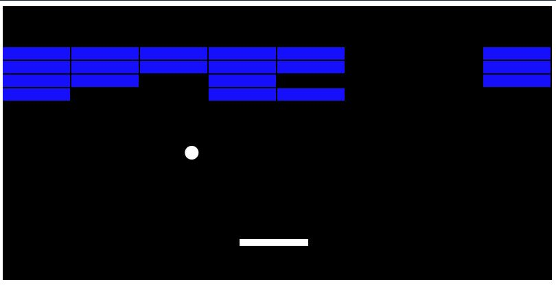

# Brick Breaker Arcade Game

In one of the JavaScript classes I learned about canvas, and how JavaScript could be used to render something on the page.
I really liked the idea and decided to explore it. I found an amazing tutorial (unfortunately lost the name and the source),
which showed how to create one of the best games of all times - An Arcade Brick Bracker! In my first attempt to follow this tutorial many months ago, I got an error, and I had no idea what to do. About one month ago, learning a lot more about debugging I was able to find my error, and re-create the code. The best thing is that now that I have the base code for this game, I can create game controls to allow the player to select colours, number of tiles, the width of the paddle, speed of the ball, add levels and difficulties, etc. 

In addition to having a lot of fun playing the game, 
I learned the importance of breaking the code into small functions
that could be re-used multiple times within other functions to create desired effects. 
